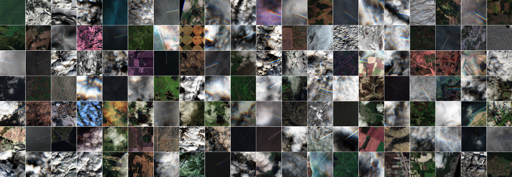

# CODECHECK certificate 2026-021 
   
This is the CODECHECK repository for the publication: 

Woldhuis, T., Engberg, Z., Rohs, S., and Meijer, V.: Observing formation and early evolution of contrails formed by IAGOS aircraft using high-resolution LEO satellite imagery, EGUsphere [preprint], [https://doi.org/10.5194/egusphere-2026-1171](https://doi.org/10.5194/egusphere-2026-1171), 2026.

The code used to generate the figures of the publication is available on GitHub with a DOI from the 4TU.ResearchData archive:

GitHub Repository: [https://github.com/ThymenW/IAGOS_Sentinel2_Landsat_Collocations](https://github.com/ThymenW/IAGOS_Sentinel2_Landsat_Collocations)  
4TU.ResearchData Repository: [https://doi.org/10.4121/a1e4d5b4-5af2-4a13-8152-a1e8d49c297f](https://doi.org/10.4121/a1e4d5b4-5af2-4a13-8152-a1e8d49c297f)  

This CODECHECK repository is a fork of the author's GitHub repository associated with the publication. The CODECHECK report is published in Zenodo ([ADD ZENODO DOI OF CERTIFICATE]).

## Summary

## Preparation steps

## Reproducing Results

### Default outputs
   
## Codechecker

- *Dr. Heather Andrews Mancilla* ([@HeatherAn](https://github.com/HeatherAn),  [0000-0002-6637-2830](https://orcid.org/0000-0002-6637-2830), H.E.AndrewsMancilla@tudelft.nl, [Technische Universiteit Delft](https://www.tudelft.nl/)  


## Formation and Early Evolution of Contrails Using High-Resolution LEO Satellite Imagery



This repository contains a **Python toolkit for analyzing contrail formation and early evolution** by matching data from three sources:  

1. **Aircraft Measurements** - Real-time measurements of temperature, humidity, and emissions from In-service Aicraft for a Global Observing System (IAGOS) commercial aircraft.   
2. **Satellite Imagery** - High-resolution images from Low Earth Orbit (LEO) satellites (Sentinel-2 and Landsat).   
3. **Weather Data** - meteorological data (ECMWF Reanalysis v5 ERA5).  

**Note**: This repository is only used for reproducing the results for the [related paper](https://doi.org/10.5194/egusphere-2026-1171). Code for data collections and exploration is added either to [pycontrails](https://py.contrails.org/) or can be requested to the author(s).

### Description

This repository contains a series of Python scripts to study the formation and early evolution of contrails produced by IAGOS aircraft using high-resolution LEO satellite imagery. The code aligns in space and time (*collocates*) the three datasets mentioned above, in order to understand when do contrails form and how they evolve in time, including their environmental impact.  

More specifically, the `./src/iagos_toolkit` contains scripts to:  
* load and process aircraft flight trajectories from ADS-B (automatic dependent surveillance) data;  
* calculate and retrieve atmospheric conditions at aircraft altitude and location;  
* process satellite imagery to detect and measure contrails.   

The notebooks provided in `./notebooks/` use the `./src/iagos_toolkit` to reproduce the results published in Woldhuis et al. (2026) (see **References**). In order to execute all notebooks, download the **full dataset** from the [4TU.ResearchData](https://doi.org/10.4121/2d66d65e-8041-4435-ab3c-0af3fdfc5d23) archive (see also **References**). Keep in mind the full dataset size is **+-50 GB**. To reproduce most paper results without the full dataset, the file `./data/landsat_sentinel_collocations_20260216.csv` can be used.  


### Repository Structure

```
.
├── README.md
├── LICENSES
│   ├── Apache-2.0.txt
│   └── CC-BY-4.0.txt
├── data
│   ├── contrail_evolution
│   │   ├── annotations
│   │   │   └── L*.json
│   │   └── cocip
│   │       └── L*.csv
│   ├── figure_2_adsb
│   │   ├── 48506d_L1C_T28UGC_A025403_20220116T120353.csv
│   │   ├── example.png
│   │   ├── figure_2_adsb_collocations.csv
│   │   └── landsat-figure2.csv
│   ├── figure_3_zoom
│   │   └── figure_3_zoom*.png
│   └── landsat_sentinel_collocations_20260216.csv
├── figures
│   ├── mozaic_low_res.png
│   └── fig*.png  
├── notebooks
│   └── figure_*.ipynb
├── pyproject.toml
└── src
    ├── __init__.py
    ├── iagos_toolkit
    │   ├── flight
    │   │   ├── __init__.py
    │   │   ├── aircraft_pars.csv
    │   │   ├── aircraft_performance.py
    │   │   └── iagos_fleet.py
    │   └── weather
    │       ├── __init__.py
    │       ├── constants.py
    │       ├── era5.py
    │       ├── iagos.py
    │       ├── isa.py
    │       └── thermo.py
    └── iagos_toolkit.egg-info
        ├── PKG-INFO
        ├── SOURCES.txt
        ├── dependency_links.txt
        ├── requires.txt
        └── top_level.txt
```

The `./src/iagos_toolkit/` folder contains the Python toolkit and it is split into two modules:    
- `flight/`: load ADS-B trajectories and calculate aircraft performance/emissions;    
- `weather/`: atmospheric calculations, ERA5 integration and thermodynamics analysis.  

The `./notebooks/` folder contains several Jupyter notebooks that reproduce the figures of Woldhuis et al. (2026). The main notebooks are:  

| Notebook | Description |
|----------|-------------|
| `figure_2.ipynb` | Collocation accuracy on ADS-B flights |
| `figure_3.ipynb` | Example of aircraft contrail |
| `figure_4.ipynb` | Location and time distribution of collocations |
| `figure_5.ipynb` | Example of contrail formed from Schmidt-Appleman Criterion (SAC) conditions |
| `figure_6.ipynb` | Collocations as a function of altitude and T_LC |
| `figure_7.ipynb` | Contrail lifetime |
| `figure_8.ipynb` | Contrail evolution in jet and vortex phase |
| `figure_9.ipynb` | Comparison between Contrail Cirrus Prediction (CoCiP) results and Annotations |

All figures generated by the notebooks are stored in `./figures/`.


### Usage

The functionalities implemented in the `./src/` directory can be used independently in your own workflows. The notebooks in the `./notebooks/` folder can be used to reproduce the results presented in Woldhuis et al. (2026) or to follow a similar methodology and analysis. 

In order to use the scripts and/or run the notebooks, first clone this repository and then install the necessary dependencies e.g. using `pip` or `poetry`:  

```bash
  # using pip
  pip install -e .  
```

```bash
  # using poetry
  poetry install
```

The scripts require Python >= 3.9, pycontrails[complete] and associated packages (see `./pyproject.toml`).  

To run the Jupyter notebooks, some can be run without the **full dataset**. To fully reproduce all figures, please download the **full dataset** from the [4TU.ResearchData](https://doi.org/10.4121/2d66d65e-8041-4435-ab3c-0af3fdfc5d23). Extract the dataset to a known location and update `DATASET_LOCATION` variable at the beginning of the respective notebooks.  

The figures generated by the notebooks are saved to `./figures/`. These figures are also provided in the folder for reference, and to allow quick inspection without re-running the notebooks with the **full dataset**.   


### Authors or Maintainers

* Thymen Woldhuis ([@ThymenW](https://github.com/ThymenW),  [0009-0000-2237-1839](https://orcid.org/0009-0000-2237-1839), t.woldhuis-1@tudelft.nl, Technische Universiteit Delft.  


### License

[](https://opensource.org/licenses/Apache-2.0)  

The code files available in this repository (python scripts and Jupyter notebooks) are licensed under the **Apache 2.0** license (see `./LICENSES/Apache-2.0.txt`). All other files (.json, .png and .csv) are released under a **CC-BY 4.0** license (see `./LICENSES/CC-BY-4.0.txt`).

Copyright notice:  

Technische Universiteit Delft hereby disclaims all copyright interest in the program "Formation and Early Evolution of Contrails Using High-Resolution LEO Satellite Imagery" written by the Author(s). Henri Werij, Faculty of Aerospace Engineering, Technische Universiteit Delft.   

© 2026, T. Woldhuis


### Cite this repository

**How to cite this repository**: T. Woldhuis, 2026, Code accompanying "Observing formation and early evolution of contrails formed by IAGOS aircraft using high-resolution LEO satellite imagery". 4TU.ResearchData. Software. https://doi.org/10.4121/a1e4d5b4-5af2-4a13-8152-a1e8d49c297f<rest of the DOI> 


### Contact

Any questions, comments or collaboration proposals? Feel free to contact the Author(s).


### References

Woldhuis, T., Engberg, Z., Rohs, S., & Meijer, V. (2026). Observing formation and early evolution of contrails formed by IAGOS aircraft using high-resolution LEO satellite imagery. EGUsphere, 1–43. https://doi.org/10.5194/egusphere-2026-1171

Woldhuis, T., Engberg, Z., Rohs, S., & Meijer, V. (2026). Dataset accompanying "Observing formation and early evolution of contrails formed by IAGOS aircraft using high-resolution LEO satellite imagery". Version 1. 4TU.ResearchData. dataset. https://doi.org/10.4121/2d66d65e-8041-4435-ab3c-0af3fdfc5d23.v1